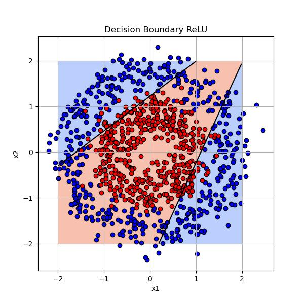
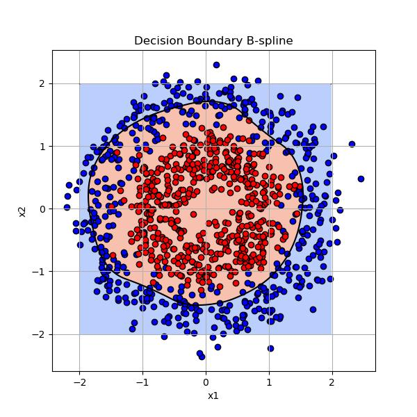
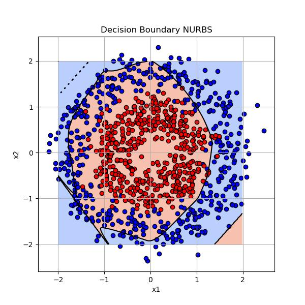

# Learnable activation functions in MLPs

Investigation of different approximation and interpolation curves as activation functions in MLPs.

## Outline
### Tasks
* Implement B-spline activation function
* Implement NURBS activation function
* Implement interpolation curve-based activation functions (Lagrange, Catmull-Rom and other Hermite splines etc.)
* Visualize activations
* Compare these learnable alternatives to ReLU:
    * training time
    * loss, accuracy
    * number of parameters
    * minimal network structure needed for the NN to perform well
* Compare these learnable activation functions to each other
* Investigate the role of weights on edges
    * hypothesis: they are necessary

### Additional questions
* Is NURBS activation more effective in separating circularly separable 2D points (concentric circles) than B-spline?
    * guess: not necessarily
* Are spline activations more effective in separating circularly separable 2D points (concentric circles) than ReLU?
    * guess: they must be - Is the time penalty worth it?

## Tools and structure
The development and the experiments have been carried out using Jupyter Notebook in an Anaconda environment. The Python NN framework used is **PyTorch**. \
The project has been divided into two separate files. In the [first file](/assignment/Learnable_activation_functions_per_layer.ipynb), the learnable activation function implementations are such that a single layer of neurons uses the *same* activation function, as in, activation functions with the same exact parameters. In the [second file](/assignment/Learnable_activation_functions_per_neuron.ipynb), specific activation layers were employed such that every single neuron in a given layer has its own activation function with distinct, learnable parameter values.

## Results and conclusions
In the project, B-spline, NURBS and Lagrange activation function and layer classes have been created, extending torch.nn.Module. The parameters for said classes include: \
B-spline and NURBS:
* k, the order of the curve (*mistakenly named degree, but the degree of the curve is actually k-1*)
* number of control points
Lagrange:
* degree

All of these layers were tested on a simple sine function approximation task, using minimal NN architectures and matplotlib for visualization. 

### Experiment 1 - Graduate admissions
The usability of the learnable activation layers has been tested using the Graduate Admissions dataset, focusing on predicting the probability of admission based on a student's achievements (GPA, language exams...). The dataset was not subjected to any balancing before training. First, a 2:8 test-other split was carried out, then a 1:9 validation-train split on the *other* set. As a result, the networks were trained on 400 entries, of which 40 was used exclusively for validation. The remaining 100 records were used for subsequent testing. \

Four separate neural networks were constructed for this task:
 - one using ReLU activation (control), 
 - one using B-spline activation
 - one using NURBS activation
 - one using Lagrange activation

Each of these networks had the same basic architecture:
 - a linear layer with 64 outputs with trainable weights on edges
 - current activation function (leading to differing trainable parameter counts for each network) 
 - *dropout layer*
 - a linear layer with 64 inputs, 32 outputs with trainable weights on edges
 - current activation function (leading to differing trainable parameter counts for each network)
 - *dropout layer*
 - a linear layer with 32 inputs, 1 output with trainable weights on edges
 - sigmoid activation to get probability values between 0 and 1

*Dropout layers were only included in the case of per neuron parametrised activation functions, as networks working with these tended to overfit otherwise.*

#### Parameters per layer
The results of an example run:
| model_type | train_time | test_mse | test_mae | test_r2   | epochs |
|------------|------------|----------|----------|-----------|--------|
| ReLU       | 0.454681   | 0.004301 | 0.046473 | 0.789688  | 203    |
| B-spline   | 2.436434   | 0.004991 | 0.052190 | 0.755945  | 58     |
| NURBS      | 5.151371   | 0.004952 | 0.049677 | 0.757834  | 125    |
| Lagrange   | 5.248098   | 0.077519 | 0.248290 | -2.790669 | 74     |

- As expected, ReLU activations ran by far the fastest (1 order of magnitude lower training times than for learnable activations)
- The usage of B-spline and NURBS activation functions resulted in very similar test loss values.
- Lagrange activation functions produced the most unfavourable results: an order of magnitude higher loss values.
- The test MSE, MAE and $R^2$ values were very similar for ReLU, B-spline and NURBS activations.
  - When using B-spline or NURBS activations, less epochs were needed to produce the same results.
  - This suggests that the optimisation of these learnable activation layers might be advantageous even if we cannot reach the fast performance of a parameterless ReLU function. Less epochs means less backpropagation, which can prove to be a true benefit of these approximation curve-based learnable activation functions.
- As evidenced by the loss diagrams, B-spline and NURBS activation functions provided standard train and validation loss convergence. 
- When using Lagrange activation functions, the oscillation of train and validation losses became worryingly high, backpropagation seemed to completely stop working, no clear convergence could be observed. In my opinion, this was due to backpropagation getting tangled because of the usage of the same activation function on multiple nodes, since this issue was much less prominent in the per-neuron case.

#### Parameters per neuron
The results of an example run:
| model_type | train_time | test_mse | test_mae | test_r2  | epochs |
|------------|------------|----------|----------|----------|--------|
| ReLU       | 0.680423   | 0.004246 | 0.045300 | 0.792373 | 168    |
| B-spline   | 7.581138   | 0.005367 | 0.055986 | 0.737574 | 135    |
| NURBS      | 6.189730   | 0.005251 | 0.053236 | 0.743238 | 131    |
| Lagrange   | 12.055812  | 0.020333 | 0.115161 | 0.005720 | 149    |

- In the case of learnable activations parametrised per neuron instead of per layer, **overfitting** turned out to be a major issue.
  - Without regularization, the B-spline activation reached its best validation loss of about 0.01 around epoch 20, then proceeded to always overfit.
  - Therefore, dropout layers were introduced to help prevent overfitting.
- As expected, ReLU activations are by far the fastest (1 order of magnitude lower training times than for learnable activations)
- The usage of B-spline and NURBS activation functions resulted in similar training times, training epoch numbers and test losses.
- Lagrange activation functions produced the most unfavourable results: higher losses and training times.
  - Judging by the last distribution diagram and the $R^2$ value, the network mostly just learnt to predict the sample mean in this case. 
- The test MSE, MAE and $R^2$ were similar for ReLU, B-spline and NURBS activations.
  - When using B-spline or NURBS activations, less epochs were needed to produce these results.
  - This suggests that the optimisation of these learnable activation layers might be advantageous even if we cannot reach the fast performance of a parameterless ReLU function. Less epochs means less backpropagation, which can prove to be a true benefit of these approximation curve-based learnable activation functions.
- As evidenced by the loss diagrams, B-spline and NURBS activation functions provided standard train and validation loss convergence (with a slight oscillation in the training loss possibly due to dropout layers). 
- When using Lagrange activation functions, the oscillation of the validation loss is quite high at the beginning
  - However, contrary to the per-layer case, backpropagation seems to work, since the oscillation decreases as more and more epochs are completed and a convergence can be observed to the training loss. The higher variation in loss may exist due to the the implementation of the related Lagrange coefficient calculations. Maybe backpropagation struggles with these non-optimised calculations?

### Experiment 2 - The role of linear layer weights
It is important to note that in *Experiment 1*, **linear layer weights** were preserved and set to learnable not only for ReLU but also for learnable activation function-based networks.
 - In theory, the learnable curves could absorb the effects of weights.
 - Possibly not in this particular NN configuration, as the elimination of weighted sums makes every input edge have the same "importance" in the curve calculations that follow. In *Experiment 2*, I tried to investigate this hypothesis.
 - For a network architecture that allows for the complete elimination of edge weights, see Kolmogorov-Arnold Networks.

For this experiment, simple minimal network structures were employed and NURBS activation was used. The trainable parameter count remained quasi-constant across all examined networks. In the case where linear layer edge weights were excluded, they were uniformly set to 1. In these instances, the parameter counts of networks were adjusted (increased) in two distinct ways:
1. By adding more layers, thereby more activation functions with more parameters
2. Increasing the parameter count of existing activation functions by increasing the control point number parameter of the NURBS layers

#### Parameters per layer
Here, the parameter count remained between 350-400 trainable parameters. \
The results of an example run:
| model_type                  | train_time | test_mse | test_mae | test_r2   | epochs |
|----------------------------|------------|----------|----------|-----------|--------|
| NURBS + edge weights       | 5.327599   | 0.023106 | 0.122606 | -0.129889 | 82     |
| NURBS - edge weights (added layers)        | 45.056275  | 0.026947 | 0.130592 | -0.317707 | 205    |
| NURBS - edge weights (added control points)    | 62.485577  | 0.077308 | 0.209843 | -2.780338 | 333    |

In this case, all experiments led to highly dissatisfactory results, the smaller network structure did not perform well at all. The negative $R^2$ values indicate that the models are worse than a dummy model that always predicts the sample mean.

- Regardless of the usage of edge weights, similar parameter numbers led to similar training outcomes in test MSE and MAE.
- NURBS activations without learnable edge weights lead to an oscillation of not only validation, but also train loss. This might suggest that classic backpropagation (that in itself does not guarantee an improvement epoch by epoch) struggles more in providing a clear decrease in loss in the case of learnable activation functions (linearities are easier to backpropagate for than nonlinearities).
- Training times for the no-edge-weights models are exceptionally high in both cases. This - at least partially - is probably due to the higher number of epochs within which the early stop criteria is not met, so these versions simply train for more epochs, therefore longer. Of course, the backpropagation and forward calculations are also more complex, thus more time-consuming for NURBS curve parameters than for simple linear parameters.

#### Parameters per neuron
Here, the parameter count remained between 750-800 trainable parameters. Dropout layers were included after each NURBS activation layer. \
The results of an example run:
| model_type                                      | train_time | test_mse | test_mae | test_r2  | epochs |
|------------------------------------------------|------------|----------|----------|----------|--------|
| NURBS + edge weights                           | 7.750526   | 0.004780 | 0.053887 | 0.766278 | 245    |
| NURBS - edge weights (added layers)            | 6.830127   | 0.015221 | 0.092278 | 0.255721 | 169    |
| NURBS - edge weights (added control points)    | 8.090295   | 0.011274 | 0.080323 | 0.448722 | 215    |

This first row of the table highlights the fact that with learnable per-neuron activations, smaller networks can be pretty much as effective as the larger ones in *Experiment 1*. This is the reason why I would propose the further investigation of this particular variant out of the two cases (per-layer, per-neuron).

- In this per-neuron case, compared to the per-layer parametrisation of the NURBS curve, a more considerable difference can be observed between the with-edge-weights and no-edge-weights results.
- The edge weights seem to help a lot, their inclusion generally resulting in a lower loss and higher $R^2$ value than the experiments without edge weights.
- The added control points variant of the no-weights network sometimes produces fairly good results, but other times remains closer to a test loss of around 0.01.
- In this specific example, training times remain similar, independent of the presence of edge weights, since the no-edge-weights versions generally run for fewer epochs before they overfit.

### Experiment 3 - Concentric circles
A simple dataset created with the make_circles() function was separated using B-spline, NURBS and ReLU activations, in a single-layer, 2-neuron setup, with per-neuron activation functions. After training, decision boundaries were visualized to show the power of learnable activation functions. While the ReLU activation function separated the plane in straight lines, B-spline and NURBS activations managed to create curvy, quasi-circular decision boundaries, even with the limited number of layers and neurons involved.

ReLU | B-spline | NURBS
--- | --- |---
 |  | 

## Main takeaways
- The per-neuron setup of learnable activation layers seems to be more promising than the per-layer one.
- Unfortunately, my Lagrange activation function implementation is neither efficient, nor accurate. On the other hand, the B-spline and NURBS activation functions work as intended.
- Linear layer weights on edges seem to be quite important in the per-neuron setup, as hypothesized before.
- Learnable activation functions allow for solving simple tasks in less epochs or with less network depth.
- Learnable activation functions should be optimised to have reasonable training times.
- Special attention should be paid to the prevention of overfitting when employing learnable activation functions.

## Worth examining
- In the case of B-spline and NURBS curves, should the knots be uniformly distributed or initialized in a different way?
- How to initialize other activation curve parameters?
  - For now, torch.randn is used in most cases, so there is random sampling from a normal distribution.
  - For NURBS curves, B-spline type initialization seems to yield the best results (random points, uniformly 1 weights).
- Experiments on other, preferably more complex datasets should be conducted.
